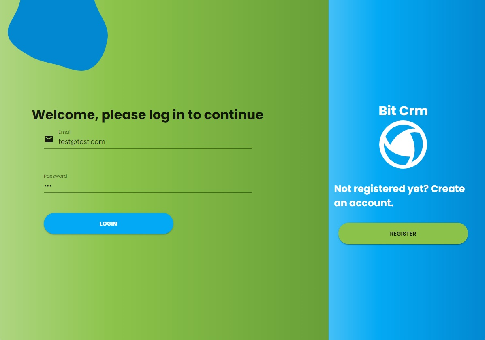
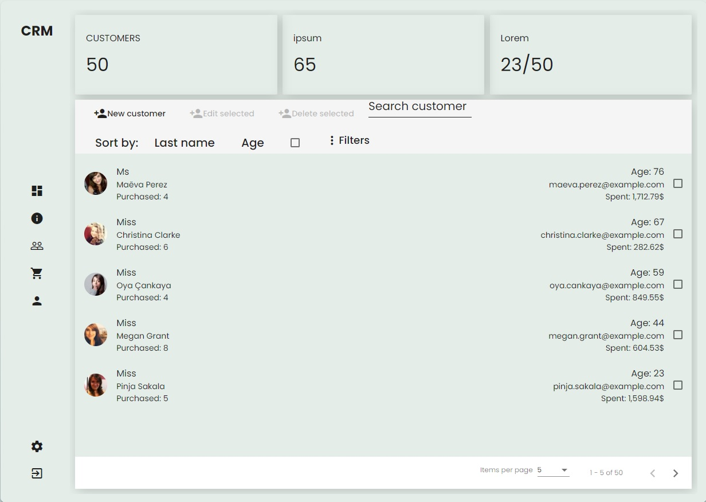
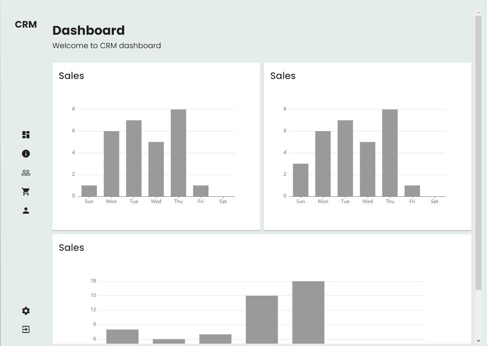
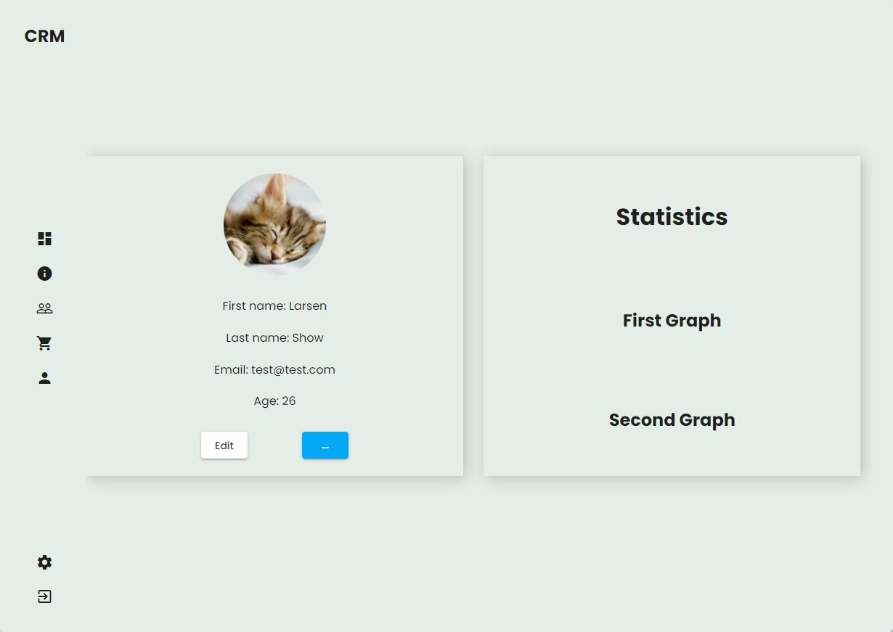
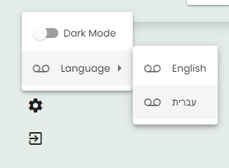
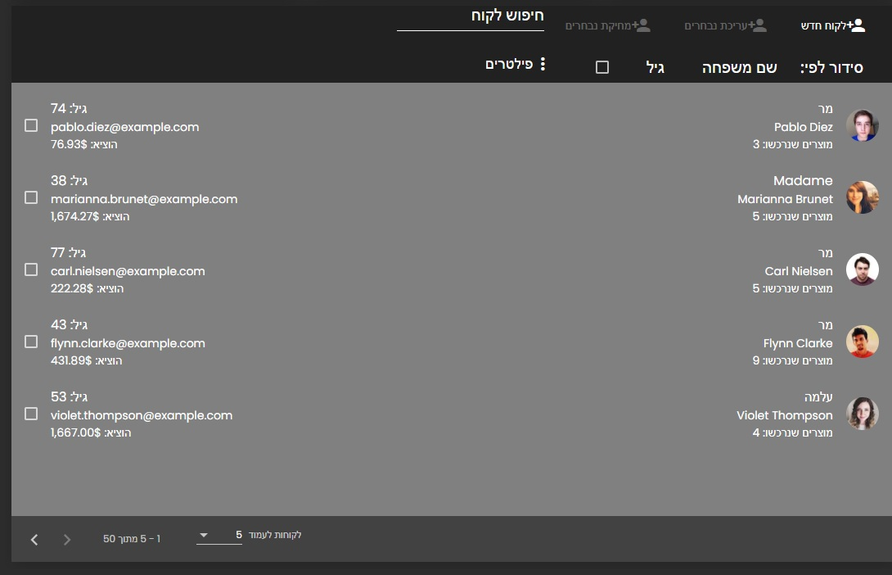
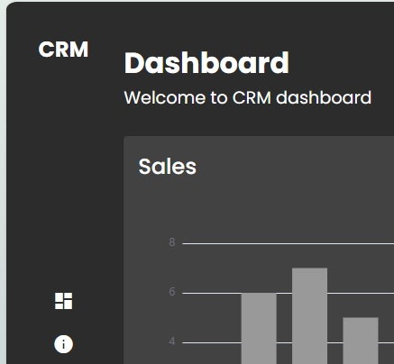

# Angular - CRM

This project is a simple "customer relationship management" app, designed to work without a server nor database.

## Login/register
In this app user is static data but creating a new user is possible.
Tester login:
test@test
123456

## Customers
This app track random people as customers, create a random X amount of purchases per customer.
You can add, edit, delete customers.
You can filter them by age, amount of purchases and amount of money spent.
You can sort them by age or last name
You can search through all of your customers (50 by default)

## Dashboard & Profile
This app contain dashboard with graphs, and a way to check user profile

## Settings

This app you can translate into Hebrew, right-to-left design and a dark theme

## Development server

Run `ng serve` for a dev server. Navigate to `http://localhost:4200/`. The app will automatically reload if you change any of the source files.
